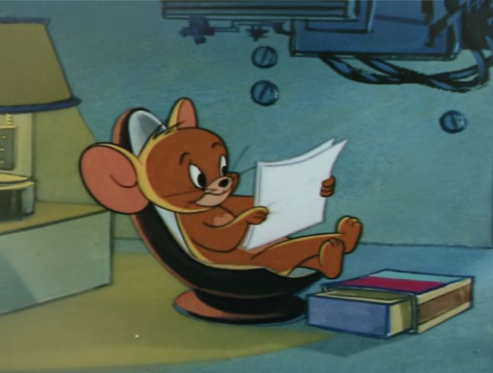
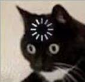

# Alan's User Page
Hey, Alan here. I discovered an interest in programming at CSE 8A (Yay, *Python!*) and has continued ever since. 

I taught myself *a bit of* React (JavaScript frontend) and Django (Python backend) and used them on a few projects. 

To be honest, I'd never think too seriously about the code structure or *design*. All I did was worrying too much about time complexity (good habit if you grind LeetCode). 

When I am not coding, you may find me either `(`in front of a piano `||` smashing in badminton court `||` reading sci-fi novels by Liu Cixin`)`. 

Bruh

# What does Markdown offer?

## Pictures

## Styling Text
- To make a text **bold**, wrap it with a pair of double stars. 
- To make a text *italic*, wrap it with a pair of single star.
- If you want ***both***, wrap it with a pair of 3-stars. 
- That's it. No ~~five-star hotel~~ in Markdown, unfortunately.

## Quoting Text
> You can fool some people all the time. You can fool all people some of the time. But you can't fool all people all the time. 

## Quoting Code
Use backticks to wrap your codes!

Rotate the matrix 90-degrees clockwise (in python): 

`M = zip(*M[::-1])`

## External links
- [This](screenshots/456.%20add%20%2B%20commit%20%2B%20push%20newly%20created%20local%20branch%20to%20remote%20repo.png) 
is how I commit and push the changes made in a **locally created branch** to the *remote repository*. 
- Play with regex (regular expression) and understand its power [here](https://regex101.com/)

## Section links
Links to other sections in this `.md` file.
1. Click [here](#quoting-code) to learn more about how to quote codes in Markdown. 
2. Link to the [section](#external-links) that talks about quoting texts in markdown. 

## Relative links
Links to another file or image in my repo. 
- `/` refer to the repo root
- `../` refer to the parent directory

Check [this screenshot](screenshots/1.%20git%20clone%20repository.png) out.

Man here's another [relative link](screenshots/7.%20staged%20changes%20(cmd%20line).png)

## The chromatic scale, checked
- [x]  Dol, a dear, a female dear
- [x]  Re, a drop of golden sun
- [x]  Mi, a name, I call myself
- [x]  Fa, a long long way to run...
- [x]  Sol, a needle pulling thread
- [x]  La, a note to follow sol
- [x]  Ti, a drink with jam and bread
- [ ]  and that'll bring us back to dol
    
(from *Sound of Music*)
